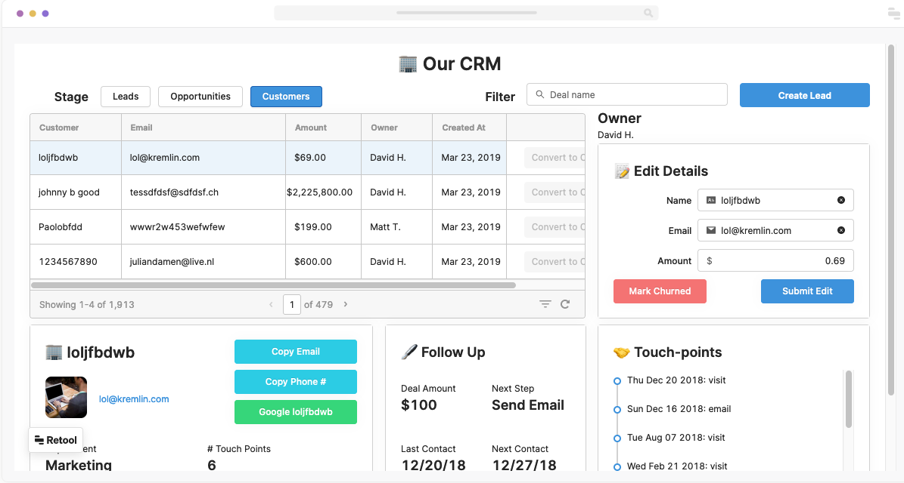
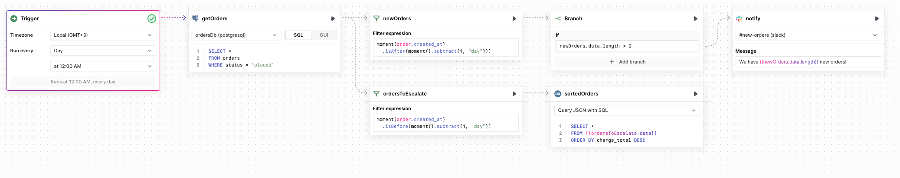
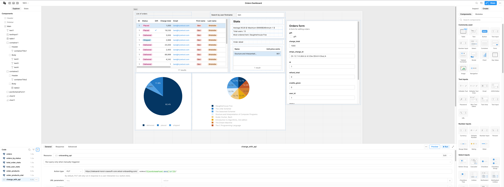
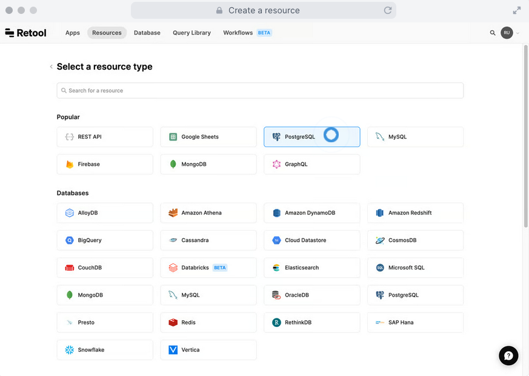
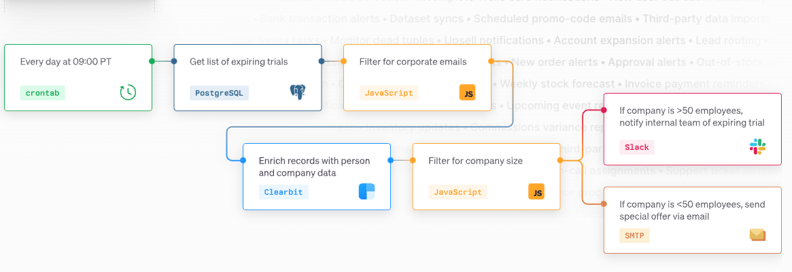
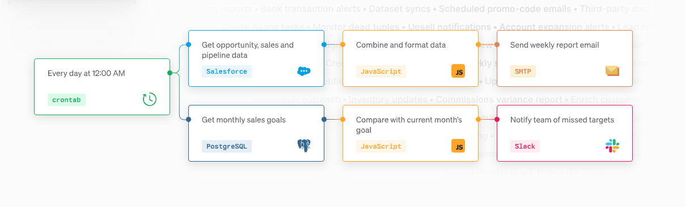
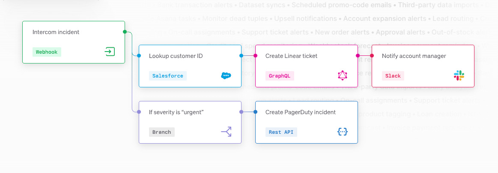
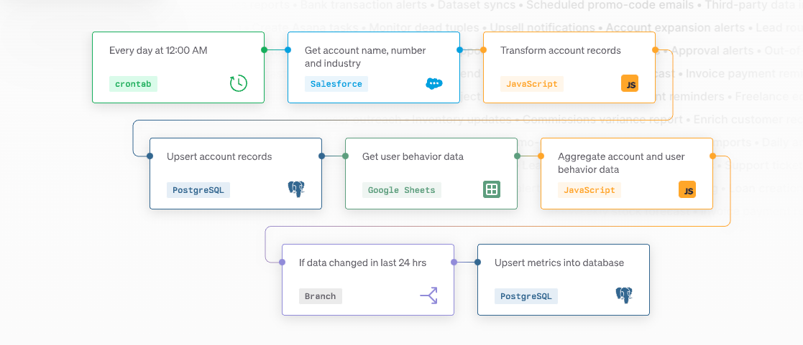

# Retool

## Introduction

Retool is a drag-and-drop UI builder that helps teams build internal tools quickly.
Based on Retool founder, almost 50% of all software is internal tools.
These tools are helpful because they are designed to meet an organization’s, or a team’s, unique needs.
They’re built to fit seamlessly into existing processes, saving employees significant time on everything from marketing campaigns to finance operations to data engineering

Challenges that come with building internal software:

- Require a lot of development time to implement and maintain
- Require extra developers to dedicate to these projects
- Priority should be client facing products not internal tools

Most common example of internal tools:

- Dashboards (Analytics, Reporting, Monitoring, etc)
- Admin panels (search, filter, and edit data from data sources)
- Interaction with various data sources

## Features

Lets break down main features of Retool:

- Apps
  - 
- Workflows(currently not available on self hosted version)
  - 

### Apps

Allows you to quickly assemble your app from components

Apps can be:

- Desktop
  - Webpage with connection to data source and interactive components
- Mobile
  - Require installation of central Retool app on your mobile device
  - Acts like mobile app

The main building block of each app is:

- Data from data sources
- Components

Here is example of interactive dashboard with order info from Retool test db:
[link](https://sandboxtest.retool.com/embedded/public/df8e566c-79d5-4300-8932-d57e7040d6ae)

It showcase:

- Connecting database for query
- Query data from related tables
- Using input element for search
- Filtering/ordering data.
- Visualization of statistical information
- Using form to send api requests to change data

#### Data from data sources

There is a rich set of data sources that are available in retool (API, DB, files, etc)
When working on app you can create a query to retrieve/modify specific data from data source

#### Components

This allow to build app with various components, in simple drag-and-drop format.

List of available component are similar to any component library for frontend (like antd, mui, mantine)
and should cover most of use cases.
Each component have a state that you can use(pass to another components, use in queries, etc.)

### Workflows

Allows you to build workflows that feet your needs.

Popular use cases:

- Monitoring & alerting
  - Pipe data from an API endpoint to your data warehouse, fix inconsistencies across disparate datasets, or centralize third-party data into your internal databases.
  - 
- Metrics and reporting
  - Send daily emails capturing progress against sales forecasts, post hourly usage to Slack, or share business KPIs with investors.
  - 
- Custom notifications
  - Send personalized offers to customers, email invoice reminders, or notify your team of new user signups.
  - 
- Lightweight ETL
  - Set up out-of-stock alerts, surface suspicious transaction activity, or triage customer support tickets based on severity.
  - 

Each workflow can contain multiple blocks, this blocks can be:

- Trigger (Can be set in crontab or regular format, or webhook event)
- Query (from supported data source (API, DB, files, etc.))
- Code block (Python, JS(only JS currently support libraries))

Example of workflow that are:

- Every hour get not processed orders and ping team to channel via telegram
- Every 1 day of month get total quantity of orders and ping team in channel
- Alert when new user are signed up

Each workflow can be imported and exported as json

## Pricing and alternatives

There is 4 tiers available:

- Free
  - 5 users max
  - 5 GB of data storage
  - 1 GB of workflow data
- Team
  - 10$ month for user
  - 5$ month for end user
  - 5 GB of data storage
  - 1 GB of workflow data
  - App versioning
- Business
  - 50$ month for user
  - 15$ month for end user
  - 5 GB of data storage
  - 1 GB of workflow data
  - App versioning
  - Audit logging
  - App-level permissions
  - Unlimited environments
  - Unlimited modules
- Enterprise
  - Everything in Business, plus
  - SAML / OpenID Connect SSO
  - Source control
  - Multi-instance deployments
  - Custom branding
  - Dedicated support

Considering this include hosting, unlimited workflows runs, unlimited apps, having all in one tool for all your internal apps and automation tasks via workflows seems reasonable

There is couple of alternatives when it comes to separate features:

- App low code app building [tooljet](https://www.tooljet.com)
- Dashboards/Data Visualization/Reports can be managed by redash
- Automation of workflows can be managed by automatisch

With all this features, and positive sides this tool can only be used for internal apps, it cannot be used for providing solutions for client

## Related links

- [example_app](https://sandboxtest.retool.com/embedded/public/df8e566c-79d5-4300-8932-d57e7040d6ae)
- [retool](https://retool.com/)
- [redash](https://redash.io/)
- [automatisch.io](https://automatisch.io/)
